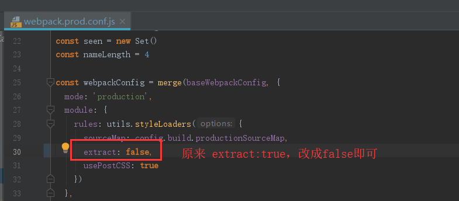
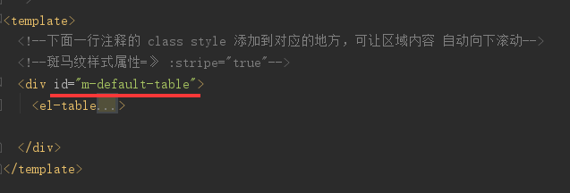
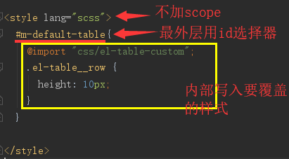

# 开发记录

## 工程名称

《数据可视化系统》

## 前言

这是基于litemall-admin（VUE 前台）工程的二次开发项目，
并将 vue-tiny-cod 工程的看板功能优化并迁移到此工程中，从而形成该系统的雏形

## 1、webpack打包工程后，图标不显示
### 问题描述
webpack打包工程后，图标不显示，经过浏览器调试，发现 element-icons.535877f.woff 的下载路径出错，
错误路径如下所示
http://localhost:9090/litemall-board-admin/static/css/static/fonts/element-icons.535877f.woff
http://localhost:9090/litemall-board-admin/static/css/static/fonts/element-icons.732389d.ttf
而这两个文件打包后的真实路径是
http://localhost:9090/litemall-board-admin/static/fonts/element-icons.535877f.woff
http://localhost:9090/litemall-board-admin/static/fonts/element-icons.732389d.ttf
所以打包工程后，图标不显示
### 解决方案
了解问题后，正确的百度查询方式：vue打包之后 ttf 请求地址不对
找到的有效解决方案：https://blog.csdn.net/weixin_34087307/article/details/91398561
webpack 配置问题
在 build/webpack.prod.conf.js 中 extract :true 改为 fasle即可。
    

## 2、在不同浏览器中，页面高度控制问题
### 问题描述
原来是通过css class样式的这样的 height:38rem 方式进行设置页面高度的，但是在同浏览器中，页面的分辨率不同，
也就导致了，低像素浏览器（如：Google Chrome）里撑满显示的尺寸，到了高像素（如：百度浏览器）里就没撑满，
甚至只有一般的高度，很不好看
### 解决方案
在通过js初始化时声明一个获取页面可视区域的一个合适的尺寸比例，
比如：
```javascript
this.pageHeight = (document.documentElement.clientHeight * 0.86)
```
然后在页面中通过 :style="{height:pageHeight}" 的方式进行控制页面中元素的高度
也可以根据需要进行加减，比如 :style="{height:pageHeight - 100}"

## 3、在造成全局污染的情况下，对当前的第三方组建进行样式修改
### 问题描述
在修改element-ui的el-table组件的样式时，希望只对当前的el-table进行样式修改，于是就覆盖el-table的相关样式，
但是 scope 后，并不会有效果，因为scope的样式只会先被写入，确实对当前组件的样式有效，但会被全局样式覆盖；
如果不加 scope 又会造成全局污染，即所有页面el-table的样式都会被影响。
### 解决方案
对当前的最外层的 标签 加上 id，然后在 scss 样式中的最外层样式通过id选择器来写样式，其内部写入要覆盖的样式，
如下图所示

    

    


## 4、_.debounce() 报错，_ 未定义
### 问题描述
_.debounce百度了半天，终于搞明白，这里涉及到一个库 lodash 的使用，可以百度一下 vue 中使用 lodash，
以及 lodash 的相关资料

### 解决方案
安装 lodash 库，并在 main.js 中定义到全局属性中
```text
npm i lodash -S
```
在 main.js 中定义到全局属性中,对应属性名为 _
```vue
import _ from 'lodash'
Vue.prototype._ = _
```

## 5、如何解决工程打包后，也能方便的修改后台接口访问地址URL，而不必对工程重新打包
### 问题描述
我们在打包好工程，再部署到服务器上之后，有可能需要修改后台接口访问地址URL（IP或端口号），那么原来的方式，
只能重新打包，再重新部署到服务器上，很不方便，我们需要能够有一个配置文件，让我们可以直接修改，这样就不必
为了修改IP和端口号这种小问题而重新打包了
### 解决方案
这里只写出一个最可靠的方案：
在 static 目录下新建一个 xxx.js 文件（此工程中我命名为 serverconfig.js）,其中写入后台接口的相关内容，
比如此工程中的 serverconfig.js 的内容如下（window.g是js全局变量）
```js
window.g = {
  dep: {
    NODE_ENV: 'production',
    ENV_CONFIG: 'dep',
    BASE_API: 'http://www.micking.top:8580/admin',
    BOARD_API: 'http://www.micking.top:8580'
  },
  dev: {
    NODE_ENV: 'development',
    ENV_CONFIG: 'dev',
    BASE_API: 'http://www.micking.top:8580/admin',
    BOARD_API: 'http://www.micking.top:8580'
  },
  prod: {
    NODE_ENV: 'production',
    ENV_CONFIG: 'prod',
    BASE_API: 'http://www.micking.top:8580/admin',
    BOARD_API: 'http://www.micking.top:8580'
  }
}
```
然后在工程根目录下的 index.html 中引入脚本(建议写在所有脚本的最前头，即最先引入)
```html
<script src="static/serverconfig.js"></script>
```
以上步骤完成后，即可在需要的地方使用了
使用方式如下(这里按照上面的serverconfig.js脚本配置内容写的案例，window.g后面的属性根据自己赋值的情况
而定，自己赋值什么名称的属性，就写什么)
```js
window.g.prod.BASE_API
```
此工程中的使用在 src/utils/request.js 和 src/utils/requestBoard.js 两个脚本中
